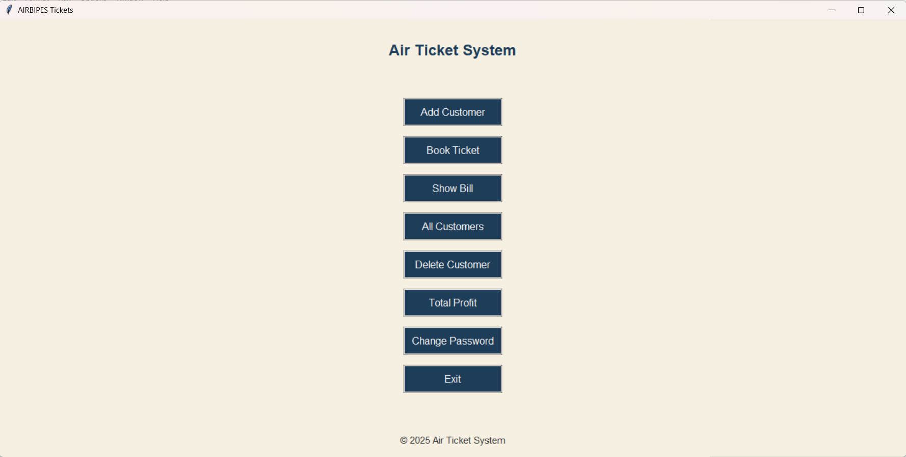
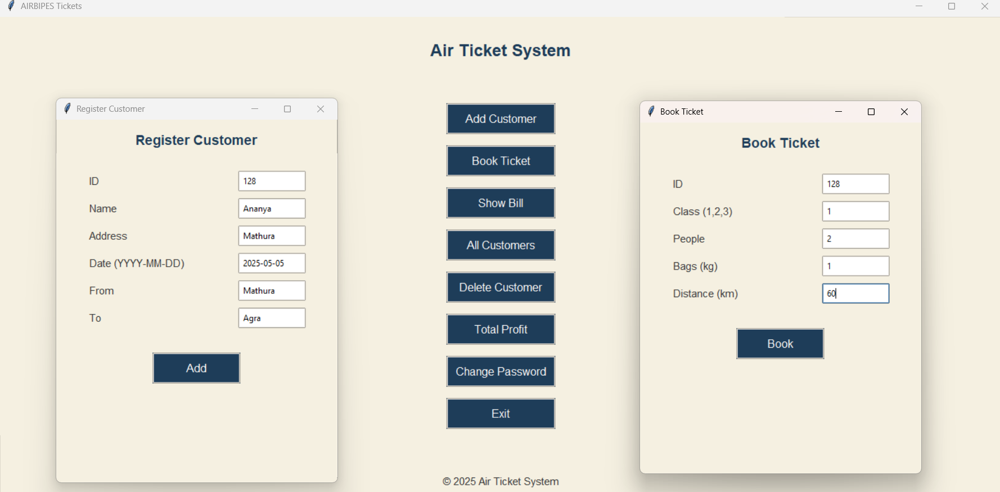
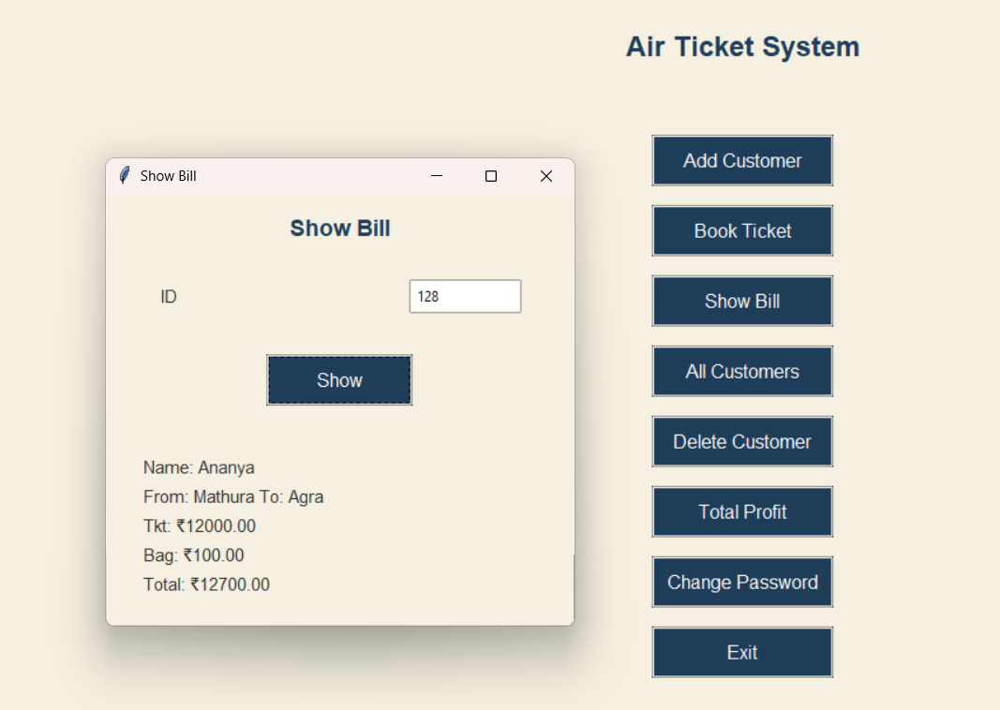
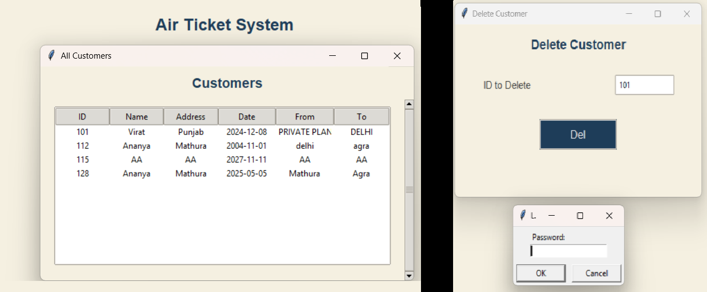
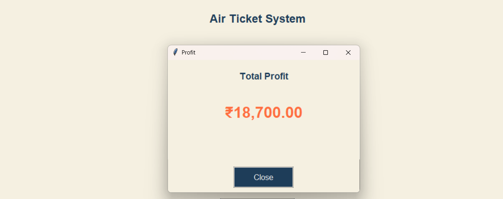
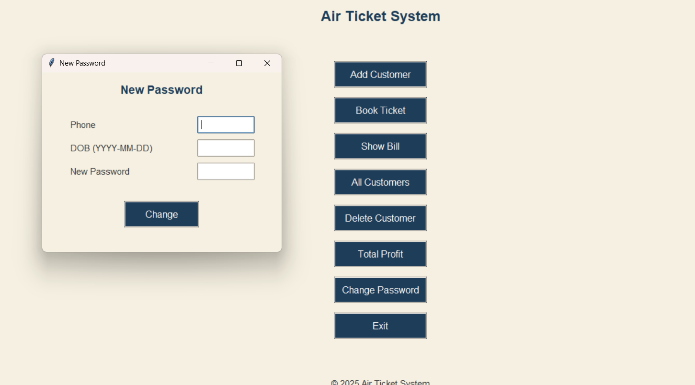

# AirBipes Ticket System

A simple air ticket booking system built with Python, Tkinter, and MySQL.

## Features

- **User Registration**: Add new customers with their travel details.
- **Ticket Booking**: Book tickets based on class, people, luggage, and distance.
- **Bill Generation**: View a detailed bill for booked tickets.
- **Customer Management**: View, delete, and manage customers.
- **Profit Calculation**: Calculate total profit from bookings.
- **Secure Access**: Password-protected admin functions.

## Screenshots

Preview:
<br>
<br>

<BR>
The Colourful UI interface at the begining allow operator person to perform multiple tasks
<BR>


<BR>

Register new customers and also fill there Data releted to journey
<BR>


<BR>

Generates bill of the customers Corrosponding to their registered no.
<BR>


<BR>

Operator can check all data by enter security password and also cam delete it.
<BR>


<BR>

Produces the Total cash collected on the particular day and Display with some security checks.
<BR>


<BR>

Server can change the passwords in case of foret it by Some security questions and Can exit from Window by Exit.


## Setup Guide

### Prerequisites

Ensure you have the following installed:
- Python 3
- MySQL Server
- Required Python libraries (Tkinter, MySQL Connector, PIL)

### Clone the Repository

```sh
git clone https://github.com/yourusername/AirBipes-Ticket-System.git
cd AirBipes-Ticket-System
```

### Install Dependencies

Install required Python packages:
```sh
pip install mysql-connector-python pillow
```

### Database Setup

1. Open MySQL and create a new database:
   ```sql
   CREATE DATABASE new;
   USE new;
   ```
2. Create tables:
   ```sql
   CREATE TABLE pdata (
       custno INT PRIMARY KEY,
       custname VARCHAR(100),
       addr VARCHAR(255),
       jrdate DATE,
       source VARCHAR(100),
       destination VARCHAR(100)
   );
   
   CREATE TABLE tkt (
       custno INT,
       tkt_tot INT,
       lug_tot INT,
       g_tot INT,
       FOREIGN KEY (custno) REFERENCES pdata(custno)
   );
   ```

### Running the Application

```sh
python airbipes.py
```

## Technologies Used

- **Frontend**: Tkinter (Python GUI)
- **Backend**: MySQL (Relational Database)
- **Programming Language**: Python

## Future Enhancements

- Improve UI/UX with better design elements
- Implement online booking and payment integration
- Add admin dashboard for better customer management

## Contributing

Contributions are welcome! Feel free to fork this repo and submit a pull request.

## License

This project is open source and available under the MIT License.

## Contact

For any issues or suggestions, please open an issue on GitHub.

---

⭐ **Don't forget to star this repository if you found it useful!** ⭐
